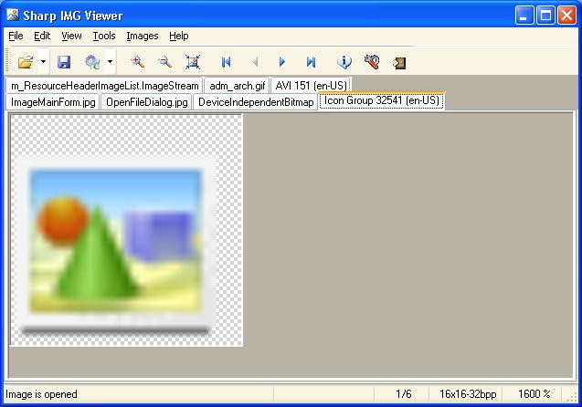

### About my developed Sharp IMG Viewer desktop application :wave:

#### Here are some facts to get you started:

- :package: Sharp IMG Viewer is a resource explorer written in C# which lets to open images, extract from various sources, save images in other formats, view image properties including metadata, perform operations on selected images.
- :speech_balloon: Sharp IMG Viewer is developed for the .NET Framework 2.0 or later. .NET Framework 3.5 Service Pack 1 is highly recommended to install the program. Microsoft Visual C++ 2010 Redistributable Package (x86) is needed to view PDF files if you are using the .NET Framework 4.0 or later.
- :seedling: Sharp IMG Viewer trial version [Download](https://github.com/MikeGratsas/sharp-img-viewer/releases/latest/download/SharpImgWixSetup.msi)
- :dancers: You can choose affiliate programs managed by [MyCommerce Share-It!](https://sites.google.com/site/sharpimg/viewer/affiliates).
- :mailbox: Please check out [Sharp IMG Viewer online documentation](https://mikegratsas.github.io/sharp-img-viewer/index.html) for questions regarding product features and installation.

- :zap: The most important supported features are:
  * Loading and saving of images in a variety of formats
  * Extracting images from assemblies, archives (ZIP, GZIP, BZIP2, LZIP, TAR, Z, PPMd, 7z, LZMA, XZ, RAR, ARJ, XAR, CPIO, Zstandard, Brotli, Snappy, LZ4, LZ5, Lizard, LZH, LZO, LZFSE, UNIX dump, Microsoft Cabinet, Encrypted APPX and WIM formats), disk image files (ISO, FAT, NTFS, EXT, SquashFS, Btrfs, XFS), virtual disk files (VMware VMDK, Oracle VirtualBox VDI, Microsoft VHD and VHDX, XenServer Virtual Appliance XVA, Apple DMG), Windows executables, resources, Shockwave Flash (SWF), video, RPM packages, compound and compiled help files
  * Transferring image data from scanner or camera
  * Sending image to E-mail and Skype recipients
  * Easy access to image metadata
  * Converting bitmap's bit depths from one to another
  * Accessing frames in an image when there are multiple
  * Basic manipulation of images, such as rotation, flipping and resampling
  * Alpha compositing and alpha blending applying layers to draw lines, shapes (rectangles, ellipses, rounded rectangles, arcs, pies, chords, polylines, polygons), curves (cardinal and Bézier splines), text strings and bar codes (ITF, Code 39, Code 93, Code 128, EAN-8, EAN-13, UPC-A, UPC-E, Codabar, Plessey, MSI, Dutch Post TNT KIX, Royal Mail CBC 4-state, Royal Mail Mailmark 4-state, USPS Intelligent Mail, Australia Post, Japan Post, DataMatrix, PDF417, Aztec, DotCode, MaxiCode, Han Xin, QR Code)
  * Barcode detection on images
  * Import and export to Adobe PDF, multipage TIFF, multiframe GIF, Scalable Vector Graphics and video files
  * Drag and drop support
  * Clipboard copy and paste operations support
  
- :boom: Supported operating systems:
  * Microsoft® Windows® 98
  * Microsoft® Windows® Millennium Edition
  * Microsoft® Windows® 2000 Professional
  * Microsoft® Windows® 2000 Server
  * Microsoft® Windows® XP™
  * Microsoft® Windows® Server 2003
  * Microsoft® Windows® Vista
  * Microsoft® Windows® 7
  * Microsoft® Windows® Server 2008
  * Microsoft® Windows® 8
  * Microsoft® Windows® Server 2012
  * Microsoft® Windows® 8.1
  * Microsoft® Windows® Server 2016
  * Microsoft® Windows® 10
  * Microsoft® Windows® Server 2019
  * Microsoft® Windows® 11
  * Microsoft® Windows® Server 2022

- :camera: Supported image file formats

Format | Description
------------ | -------------
**BMP** | Windows or OS/2 Bitmap format (\*.bmp;\*.dib;\*.rle)
**ICO** | Windows Icon format (\*.ico)
**CUR** | Windows Cursor format (\*.cur)
**GIF** | Graphics Interchange format (\*.gif)
**JPEG** | JPEG Group format (\*.jpg;\*.jpeg;\*.jpe;\*.jfif)
**PNG** | Portable Network Graphics format (\*.png)
**TIF** | Tagged Image File format (\*.tif;\*.tiff)
**WMF** | Windows Metafile format (\*.wmf)
**EMF** | Extended Metafile format (\*.emf)
**PBM** | Portable Bitmap format (\*.pbm)
**PGM** | Portable Graymap format (\*.pgm)
**PPM** | Portable Pixelmap format (\*.ppm)
**PFM** | Portable Floatmap format (\*.pfm)
**TARGA** | Targa format (\*.tga;\*.targa)
**HDR** | High Dynamic Range format (\*.hdr)
**WBMP** | Wireless bitmap format (\*.wbmp;\*.wbm)
**XPM** | X11 Pixmap format (\*.xpm)
XBM | X11 Bitmap format (\*.xbm)
CUT | Dr. Halo format (\*.cut)
DDS | DirectDraw Surface format (\*.dds)
FAXG3 | Raw Fax format CCITT G3 (\*.g3)
IFF | Amiga IFF format (\*.iff;\*.lbm)
**JNG** | JPEG Network Graphics format (\*.jng)
KOALA | Commodore 64 Koala format (\*.koa)
MNG | Multiple Network Graphics format (\*.mng)
PCD | Kodak PhotoCD format (\*.pcd)
PCX | Zsoft Paintbrush PCX bitmap format (\*.pcx)
**PSD** | Adobe Photoshop format (\*.psd)
RAS | Sun Rasterfile format (\*.ras)
SGI | Silicon Graphics SGI format (\*.sgi)
PICT | Macintosh PICT format (\*.pct;\*.pict;\*.pic)
**EXR** | ILM OpenEXR format (\*.exr)
**JP2** | JPEG-2000 File format (\*.jp2;\*.jpc)
**J2K** | JPEG-2000 codestream format (\*.j2k;\*.j2c)
**JPEG-XR** | JPEG-XR image format (\*.jxr;\*.wdp;\*.hdp)
**WEBP** | Google WebP image format (\*.webp)
ANI | Animated Cursor format (\*.ani)
**SVG** | Scalable Vector Graphics format (\*.svg)
**PDF** | Portable Document format (\*.pdf)
RAW | RAW camera image formats (many extensions)

> :exclamation: Formats supported when writing are marked in bold

:link: See also: [Sharp IMG Viewer](http://sharpimg-viewer.appspot.com/) web site
